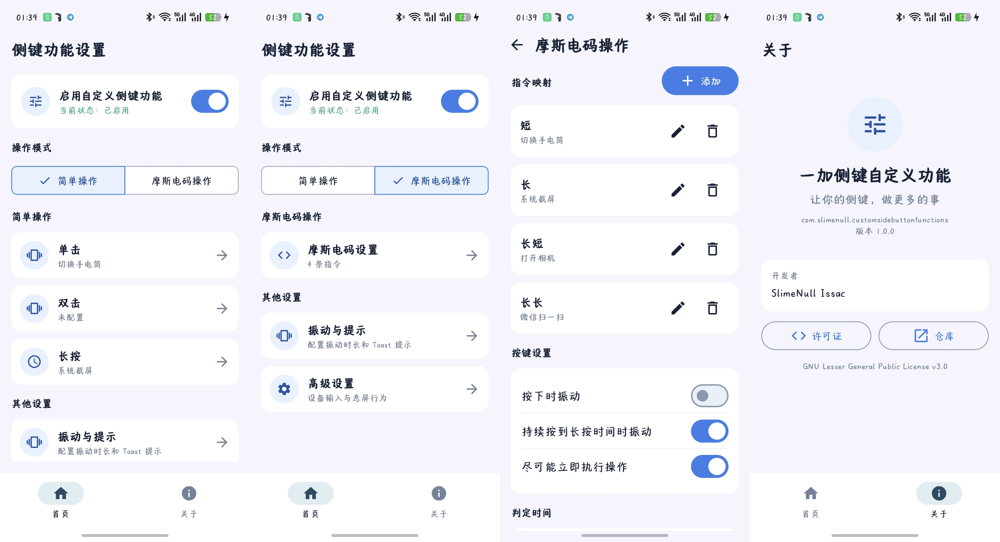

# 一加侧键功能

通过 Xposed/LSPosed 为一加、OPPO 等设备的侧边快捷键配置操作。应用提供 Compose 设置界面，按键拦截与动作执行主要运行在 Android 系统框架进程中。包名为 `com.slimenull.customsidebuttonfunctions`。

<div align="center">
  
</div>

## 安装与启用

1. 安装 APK，在 LSPosed/Vector 中启用模块，并将 **Android 系统框架（`android`）** 加入作用域。
2. 重启设备，让系统框架加载模块。只重启 SystemUI 不一定能使框架进程中的按键 hook 生效。
3. 打开“侧键功能”，保持“启用自定义侧键功能”开启，选择操作模式并配置动作。设置会自动保存，后续修改无需手动点击保存。

使用“小布快捷指令”时，还可以将 `com.coloros.shortcuts` 加入作用域：打开 ColorOS 快捷指令编辑页面时，模块会尝试把指令 ID 复制到剪贴板。此作用域不是侧键操作本身的必需条件，且依赖对应系统应用的实现。

## 操作模式

操作模式有“关闭”“简单”和“摩斯电码”三种。“关闭”模式不会处理侧键事件，系统会继续执行原本的侧键行为；“简单”和“摩斯电码”互斥，切换模式不会删除另一模式已保存的配置。

## 音量键控制输入法光标

在底部“其他”页面的“输入法光标”中，可以选择关闭、音量上键左移，或音量上键右移。该功能仍受首页“启用自定义侧键功能”总控开关控制：总控关闭时不会接管音量键。开启后，设备亮屏、未锁屏、未通话且输入法窗口可见时，音量上/下键会分别发送左右方向键；隐藏输入法后会自动恢复普通音量调节。音量键与电源键、双音量键组合会保留为系统组合键，不会被转换。

音量光标模式还可以配置长按操作：不执行任何操作、连续移动、移动到首尾。长按判定延时默认 500ms，连续移动间隔默认 32ms（约 31 次/秒），均可在页面中调整；选择“移动到首尾”时，左移方向移动到首部，右移方向移动到尾部。

该功能在 `system_server` 中拦截系统音量事件，并根据输入法窗口状态注入方向键；对于音量事件直接交给输入法服务的 ROM，还提供 `InputMethodService` 回退 hook。修改设置后会通过共享偏好热加载，不需要重启应用；修改 LSPosed 作用域或首次启用模块后仍需重启系统框架。

### 简单操作

分别配置单击、双击、长按的动作。双击动作设为“不执行操作”时，单击在松开后立即触发；配置双击后，单击会等待第二次按下，默认等待窗口为 300ms。长按在持续按住达到阈值时触发，默认 300ms；松开后不会再次触发单击。

### 摩斯电码操作

在“摩斯电码设置”中添加 `0`、`1` 组成的指令序列，并为每条序列指定动作。`0` 是短按，`1` 是长按。例如 `000` 表示连续三次短按，`01` 表示一次短按后接一次长按。

- 按下时长短于“长按持续时间”判为 `0`，达到该时长判为 `1`；默认阈值为 300ms，可设置范围为 100~800ms。
- 松开后超过“指令判断等待时间”仍未继续输入，当前序列结束并尝试匹配动作；默认等待时间为 300ms，可设置范围为 100~800ms。
- “尽可能立即执行操作”默认开启。若当前序列恰好匹配某条指令，且没有更长的指令以它开头，则立即执行：最后一位为 `0` 时在松开后判断，最后一位为 `1` 时在长按阈值到达时判断，无需等到松开。关闭后，即使已经唯一匹配，也会等待输入窗口结束。
- 尚未匹配的输入不会提前清空；继续按键时仍计入同一序列。等待窗口结束后，整段无效序列会被丢弃，避免误操作被当作另一条指令。

“按下时振动”默认关闭，“持续按到长按时间时振动”默认开启，两种提示使用 Android 预定义的短促触感。这里的按键提示与动作执行后的振动设置独立。

## 动作与反馈

两种模式均可选择响铃/振动/静音循环、免打扰、相机、手电筒、截屏、微信和支付宝快捷入口、ColorOS 快捷功能、小布快捷指令、自定义 Activity、Url Scheme，以及 Shell 指令。摩斯电码指令不提供“不执行操作”作为动作。

首页的“振动与提示”用于设置动作触发后的反馈：“触发时振动”默认开启，使用 Android 预定义的短促触感；普通 Toast 默认关闭，内容可以修改。“未知摩斯电码序列提示”独立于普通 Toast，默认关闭。开启后，无效序列结束时会显示自定义文本（默认“未知操作序列”），并触发两次短促触感，中间间隔 100ms。

简单模式的双击等待时间和长按等待时间默认均为 300ms，设置范围均为 100~800ms。

“高级设置”可配置按键码、输入设备路径，以及息屏时是否唤醒设备。默认按键码为 `735`、输入路径为 `/dev/input/event0`，息屏唤醒默认关闭。

底部导航的第二个页面为“关于”，保留开发者信息，并提供 GNU Lesser General Public License v3.0 许可证页面和项目仓库入口：`https://github.com/SlimeNull/OppoCustomSideButtonFunctions`。

## 兼容性与权限

- 模块优先 hook Oplus 的 `StrategyActionButtonKeyLaunchApp`；不可用时尝试 Android 的 `PhoneWindowManager`，最后才回退到读取 Linux 输入设备。不同设备或 ROM 的按键实现可能不兼容。
- 音量键光标功能需要将 **Android 系统框架（`android`）** 加入 LSPosed/Vector 作用域；前台应用和具体输入法通常不需要加入作用域。它依赖 ColorOS/Android 的私有输入法和输入事件接口，不同系统版本可能需要适配。
- 免打扰动作需要系统允许修改免打扰状态；若出现权限提示，请检查系统的免打扰访问权限设置。
- 截屏优先使用系统接口，失败后尝试 Shell 命令及 SystemUI 兼容广播；实际可用方式取决于 ROM。
- 自定义 Shell 指令在系统框架进程的后台线程中通过 `su` 执行，不会转发给桌面。设备需具备 Root，且 Root 管理器需允许该进程执行命令。
- 应用启动、特定快捷功能及 Toast 的行为可能受 ROM 限制。若回退到原始输入设备读取，修改输入设备路径后可能需要重启设备才能重新打开该设备。

## 构建

需要 Android SDK 和项目 Gradle Wrapper。Windows 下运行：

```powershell
.\gradlew.bat :app:assembleDebug
.\gradlew.bat :app:assembleRelease
```

产物位于 `app/build/outputs/apk/debug/` 或 `app/build/outputs/apk/release/`。Release 构建使用 `keystore/keystore.properties` 中配置的签名信息。
